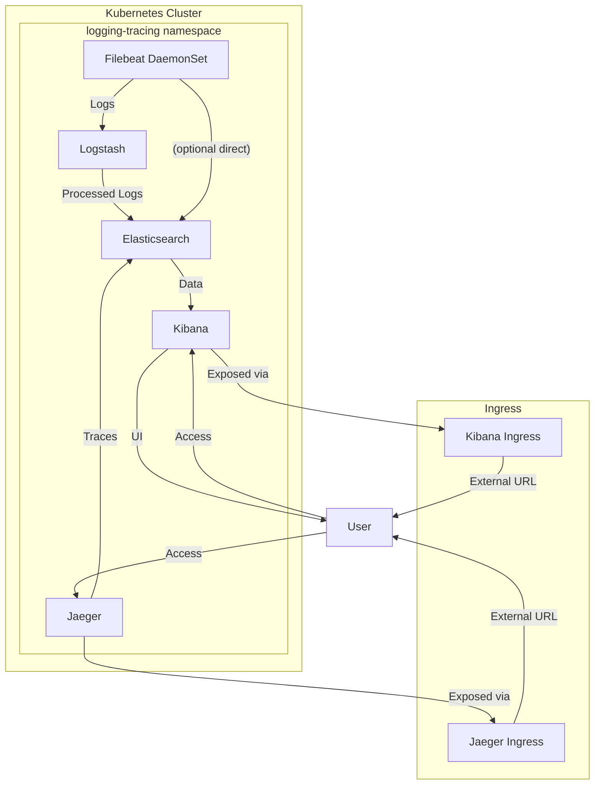

# Logging & Tracing Architecture (ELK + Jaeger)

**Description:**
- Filebeat DaemonSet collects logs from all nodes/pods.
- Logstash processes and forwards logs to Elasticsearch.
- Elasticsearch stores logs and traces.
- Kibana provides log visualization and dashboards.
- Jaeger provides distributed tracing and stores traces in Elasticsearch.
- Ingress exposes Kibana and Jaeger UIs externally.
